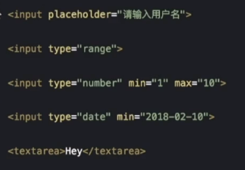
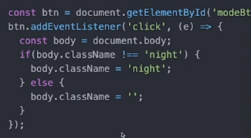

# 前端与 html

# 728 第一节课

1. web 技术栈解决多端图形用户界面交互的工程师
2. 美观、安全、兼容、功能、体验、性能、无障碍
3. nodejs 开发服务器端应用，electron、react native 开发客户端应用，web rtc 进行在线传输实现多人会议，webgl 开发流畅 3D 游戏，web assembly 将 C++、rust 语言代码编译成可以在浏览器运行的代码
4. 前端入门
   1. 编辑器：vscode、vim、webstorm
5. html 概念，超文本概念，markup language 概念
6. doctype 标记我们当前 html 文件的 html 版本，浏览器据此确定页面渲染模式，没有 doctype 会变成怪异模式
7. html 是根标签，head 标签是元数据，不需要直接呈现的；body 标签是要呈现在页面的
8. dom 树，最上层是 document->html->head/body
9. html 语法
   1. 标签和属性不区分大小写，推荐小写
   2. 空标签可以不闭合，比如 input、meta
   3. 属性值推荐用双引号包裹
   4. 某些属性值可以省略，比如 required、readonly
10. dl-dt-dd，类似于 key-value，descriptionList，dt 和 dd 是多对多关系
11. anchor 锚点-a 标签
12. controls 属性
13. input 标签的多重实现
    1. range type 滑动框
    2. date type 日期框 min 属性最小日期 xxxx-xx-xx 格式属性值
    3. number type 数字框 min 和 max 属性，上下调整
14. datalist 标签
    1. 通过 input 标签的 list 属性和 datalist 标签的 id 属性保持一致，使两者相关联
15. 通过 label 标签的 for 属性和 id 属性保持一致，是两者相绑定
16.
