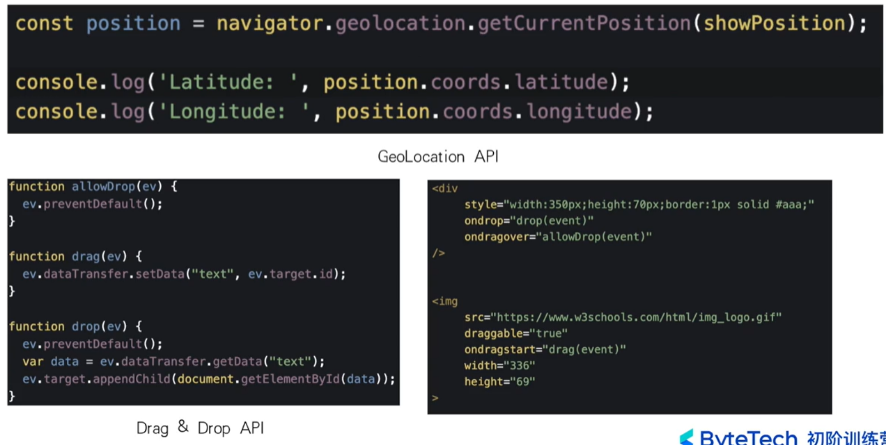
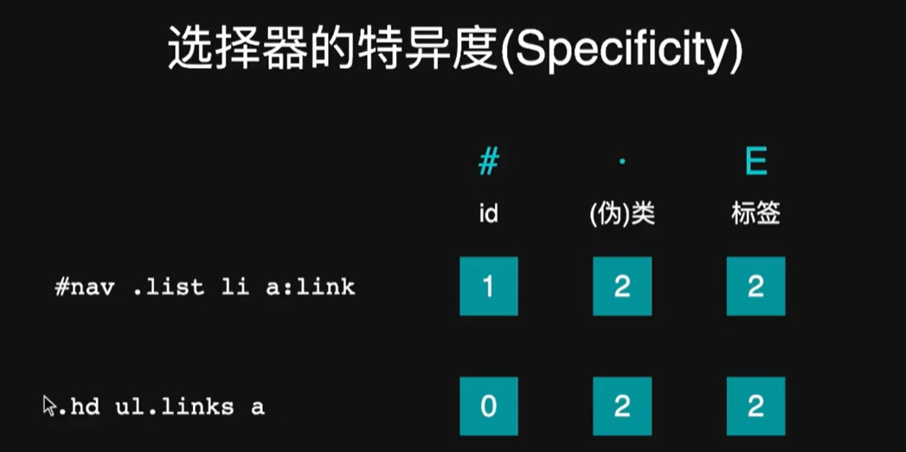
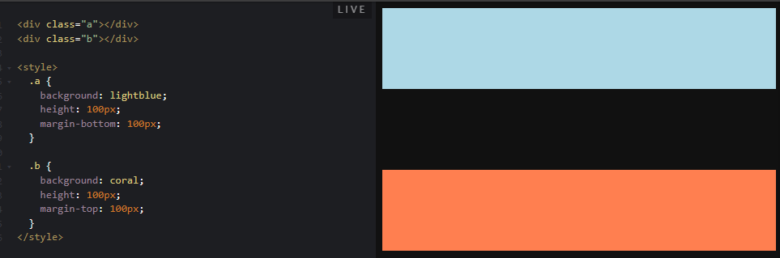

# 第二节课 前端与 html

## font-end about

1. web 技术栈解决多端图形用户界面交互的工程师
2. 美观、安全、兼容、功能、体验、性能、无障碍
3. nodejs 开发服务器端应用，electron、react native 开发客户端应用，web rtc 进行在线传输实现多人会议，webgl 开发流畅 3D 游戏，web assembly 将 C++、rust 语言代码编译成可以在浏览器运行的代码
4. 前端入门
   1. 编辑器：vscode、vim、webstorm

## html start

1. html 概念，超文本概念，markup language 概念
2. doctype 标记我们当前 html 文件的 html 版本，浏览器据此确定页面渲染模式，没有 doctype 会变成怪异模式
3. html 是根标签，head 标签是元数据，不需要直接呈现的；body 标签是要呈现在页面的
4. dom 树，最上层是 document->html->head/body
5. html 语法
   1. 标签和属性不区分大小写，推荐小写
   2. 空标签可以不闭合，比如 input、meta
   3. 属性值推荐用双引号包裹
   4. 某些属性值可以省略，比如 required、readonly
6. dl-dt-dd，类似于 key-value，descriptionList，dt 和 dd 是多对多关系
7. anchor 锚点-a 标签
8. controls 属性
9. input 标签的多重实现
   1. range type 滑动框
   2. date type 日期框 min 属性最小日期 xxxx-xx-xx 格式属性值
   3. number type 数字框 min 和 max 属性，上下调整
10. datalist 标签
    1. 通过 input 标签的 list 属性和 datalist 标签的 id 属性保持一致，使两者相关联
11. 通过 label 标签的 for 属性和 id 属性保持一致，是两者相绑定

## 语义化标签-文字性内容

1. 引用：
   1. blockquote，块级引用、长引用，直接引用一段话，cite 属性指明引文来源
   2. cite，短引用，作品名字/章节
   3. q，短引用，内容
   4. code，代码，可长可短，等宽字体
   5. pre，包裹 code，多行代码
2. 文本标签-强调
   1. **em，语气强调，重读**
   2. strong，重要严重紧急

## 语义化标签-内容划分

1. header nav main article aside footer
   - **博客内容，每篇博客放在 article 标签里面～**

## what is 语义化

1. html 中的元素、属性和属性值都有含义
2. 遵循语义来编写 html；有序列表/无序列表；**html 标签的 lang 属性指定语言**，chrome 的自动翻译

## why 语义化

1. html 的使用者
   - 开发者 修改 维护；浏览器 展示页面；
   - **搜索引擎 提取关键字、排序**（博客文章权重、SEO？）；
   - 屏幕阅读器 给盲人读页面内容；
   - **无障碍性**：img 标签的 alt 等，按钮大小，页面颜色对比度等等
2. 传达内容，而不是样式

## 如何做到语义化

1. 了解每个标签和属性的含义
   1. 要去通读所有 html 标签
   2. mdn
   3. w3c 标准
2. 思考什么标签最适合描述这个内容
3. 不使用可视化工具生成代码

# 第一节课 前端语言串讲

## css about

1. 层叠样式表
2. 伪元素和伪类选择器
   1. **伪元素选择器 有很多**（元素自身状态）
      - :hover
      - :link **a:link 可以选中所有没有被访问过的超链接标签**
      - :first-child
      - :nth-child(i)
      - :lastchild
   2. 伪类选择器（元素内容）
      - ::first-line
      - ::first-letter
      - ::before
      - ::after
3. **集联使用多个选择器**
   - 空格 大于号 加号 波浪号
4. **[]属性选择器**
   - 选择具有该属性的标签
   - 扩展选择符，^指定开头，$指定结尾，\*模糊匹配

## 浏览器

1. 包含两种引擎，渲染引擎和 js 引擎
2. 流程
   http-构建 dom 树-计算 css 树-排版-渲染合成-绘制
3. v8 引擎工作流程
4. script 标签，比较复杂，默认会阻塞
5. dom 事件机制（事件捕获事件目标事件冒泡），js 事件机制（事件循环 micro&macro task queue）![Alt text]images/(images/image-3.png)

## xx in js【好复杂】

1. html in javascript
   1. mustache {{}}模板
   2. react 的 jsx？
   3. vue 的，lang="jade"，现在改成了 lang="pug"？使用缩进表示 html 层次结构，之后 css 也是如此
2. css in javascript
   1. inline styles 直接修改，style 属性、setAttribute 等
   2. react 的 jsx，这里用的是行内样式，但是可以结合 7 的
   3. vue 的
   4. css module
   5. jss 6.补充：CSSStyleSheet 对象 
   6. 补充：第三方库

## html(原标题：你不知道的 HTML(5)，很真实，我真的不知道)

1. 基本语法
2. 标签分类
3. head 里面的标签
4. body 里面的标签
5. aria
6. h5
7. h5 表单增强
8. h5 存储
9. h5 pwa&amp
   1. 用于改进网页性能和用户体验的技术
   2. PWA 更注重提供离线访问和原生应用体验，而 AMP 更注重快速加载和提供简化的页面结构
10. h5 audio
11. h5 video
12. h5 二进制
13. h5 API
14. h5 web worker
15. h5 web socket
16. h5 shadow dom
17. h5 web component
18. h5 svg&canvas
19. webGL&webGPU
20. h5 webassembly

## 拓展

1. 大前端
2. MVC&MVVM&MVP

## 总结

1. 总结

# 第三节课 深入 css

1. css 优先级
   1. 特异度值 specificity
   2. !important>内联样式即 sytle 属性>ID 选择器>类选择器、属性选择器和伪类选择器>标签选择器、伪元素选择器>通用选择器、组合选择器、子选择器>继承的样式
   3. 什么是组合选择器
   4. 伪类和伪元素
2. 显式继承
3. 初始值 css 中常见属性的初始值
4. CSS 求值过程 https://assets.codepen.io/59477/value.svg
5. CSS 属性之间的限制
6. layout 布局
7. 布局相关技术
   1. 
   2. 
   3. 
      1. 内联元素内部即使有块级元素，对内联元素的背景色和边框也只会包含内联元素的文本，该块级元素并不会被包裹在内
      2. 内联元素
   4. flexbox？
      1. flex-direction 属性 注意 flex-direction 改变的就是主轴和侧轴的方向！
      2. justify-content 属性来控制元素在主轴上的对齐方式 justify-content 属性
      3. align-items 属性来控制元素在侧轴上的对齐方式
      4. align-self 属性（针对单个元素）
      5. order？
      6. flexibility？
      7. flex 属性
         1. 是一个复合属性，包含了 flex-grow、flex-shrink 和 flex-basis
   5. Grid 布局
      1. grid line 属性
      2. grid area 属性
   6. float 浮动布局
   7. position 属性
      1. 
      2. position:relative
      3. position:absolute
8. 盒模型
   1. width
   2. height
   3. padding
   4. border 样式粗细颜色
      1. 三种属性四个方向（可以组合）
      2.  margin
   5. margin
      1. margin:auto 水平居中（相当于同时设置 margin-left:auto;margin-right:auto;如果只设置 margin-left:auto;会紧贴右侧）
      2. margin collapse（如果上下布局的两个元素，上面元素设置 margin-bottom，下面元素设置 margin-top，会合并 margin；水平方向同理）
   6. box-sizing 两种方式（content-box 和 border-box-包括 border 和 padding）
   7. overflow
9. 块级元素和行级元素
10. display 属性 注意 none 是不参与排版
11. CSS 学习建议
